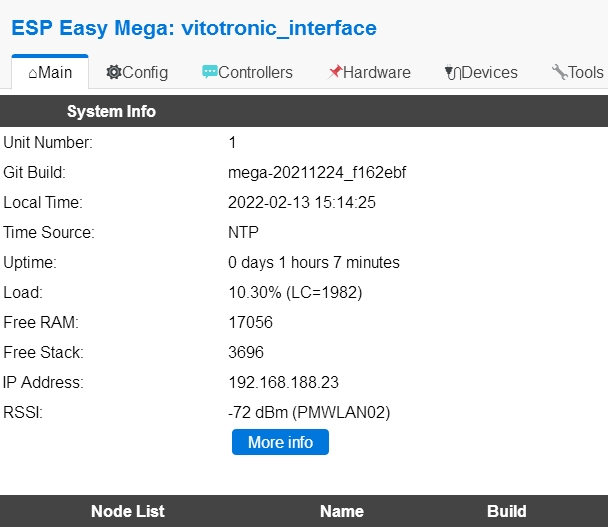
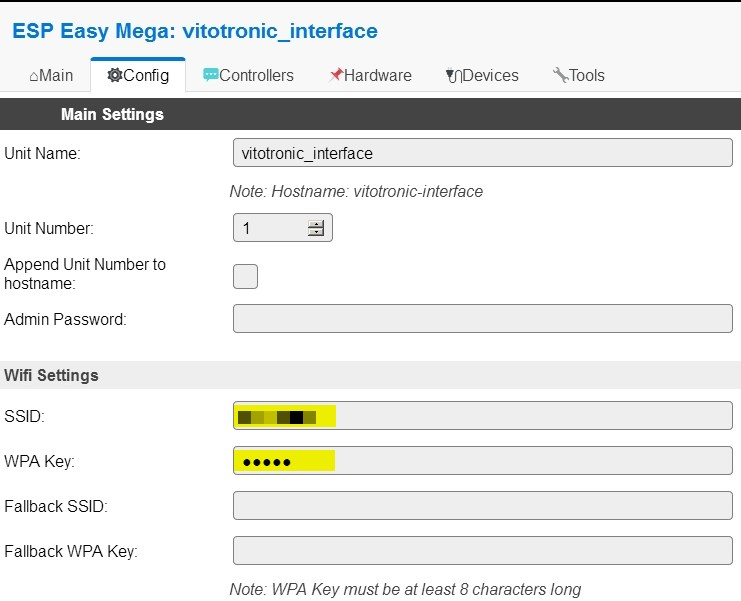
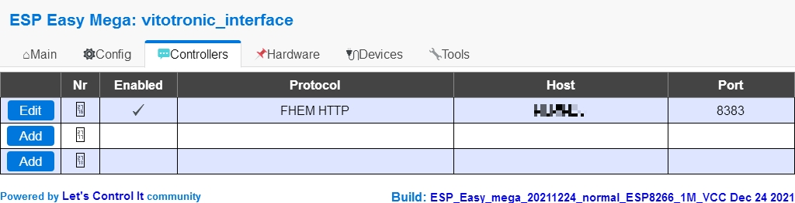
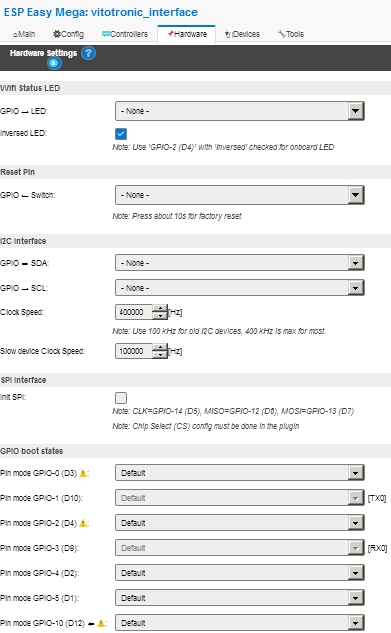
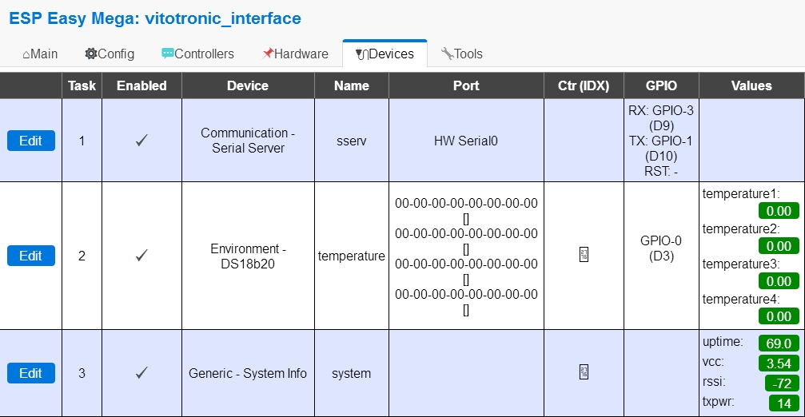
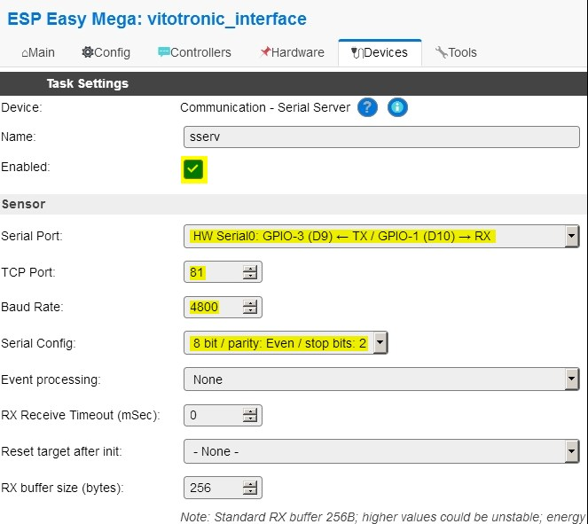
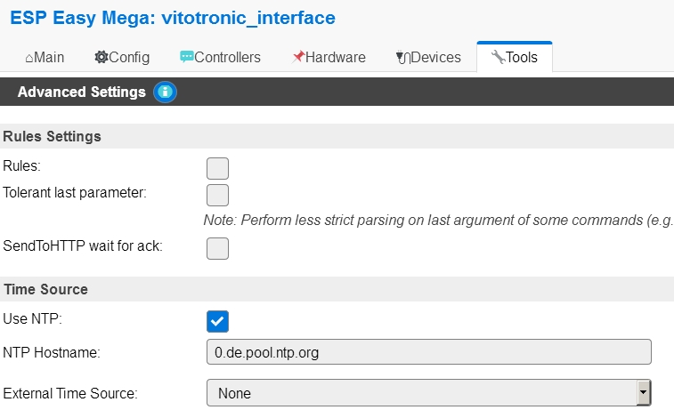

# Optolink WLAN with ESPEasy
Besides the [vitotronic_interface](https://github.com/pemue-git/vitotronic_interface) firmware, the WLAN version of the optolink adapter can also be operated with [ESPEasy](https://espeasy.readthedocs.io/en/latest/).
This howto shows the basic setup of ESPEasy. A very good introduction of ESPEasy flashing and setup can be found on [Michael Winkler's website](https://www.mwinklerblog.de/smarthome/esp-easy/espeasy-firmware/).

## Downloading and flashing
- download ESPEasy firmware from [here](https://github.com/letscontrolit/ESPEasy/releases/download/mega-20211224/ESPEasy_ESP82xx_mega-20211224.zip) and extract *ESP_Easy_mega_20211224_normal_ESP8266_1M_VCC.bin*
- flash the firmware to the Optolink adapter

## ESPEasy setup
Once you have connected to the WLAN you should be able to open to see and modify the following pages:
### long version
- Main  
  
Main tab shows the chosen ESPEasy version and other system variables.
- Config  
  
Here you should see your SSID and WPA key which were entered during initial configuration (not included in configuration file below).
- Controllers  
  
In controllers page, you can specify your controller (e.g. FHEM) which gets the data (except data from serial interface from Optolink adapter).
- Hardware  
  
In hardware settings, no changes to default settings are needed.
- Devices  
  
In devices settings the main settings for devices (serial interface, 1-wire devices, system variablesm etc.) are set.
- Devices: serial server  
  
Here the values for Optolink port (4800/8/E/2) and the WLAN port are set.
- Tools  
  
In tools NTP the NTP time server is specified.
### short version
- rename *ESPEasy_vitotronic_interface.dat* to *config.dat* and load configuration file in tools tab to ESPEasy
- adjust naming according your needs

## Resources
* for documentation purposes: [online check of MD files](https://dillinger.io/)