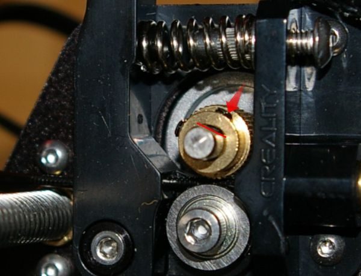

# Creality Ender 3 v2 summary

This is my first 3D printer. As I am elecronics engineer, therefore I needed a lot of reading and watching to gain proper knowledge.
This repository summarizes in short the steps I did for mounting, calibrating and using the Creality Ender 3 v2 with references to the sources I used. Maybe it helps one or the other for having good print results in less amount of time ...

## Mounting
The official manual can be downloaded from the official [Creality website](https://www.creality.com/download) (*Ender-3 V2.pdf*, 23 Jul, 2020) or found [here](doc/CE3_v2-manual_v1.3.pdf). In addition I used two youtube videos from [Tom Tullis](https://youtu.be/JTN6jtB5mqk) and [Bryan Vines](https://youtu.be/L6FZjkWcW2g) for installation and setup of the printer.

The sequence for mounting I used is as follows:
- **hint** for adjusting the force of the rollers (**4x:** printer base, nozzle kit, XE-axis kit, Z-axis passive block) [Tom Tullis, 13:25](https://youtu.be/JTN6jtB5mqk?t=805)
- remove glass bed [Tom Tullis, 8:13](https://youtu.be/JTN6jtB5mqk?t=493)
- install Z-axis profiles
  * align rotation [Tom Tullis, 17:46](https://youtu.be/JTN6jtB5mqk?t=1066)
  * align distance bottom vs. top [Tom Tullis, 22:24](https://youtu.be/JTN6jtB5mqk?t=1344)
- install X-axis profile on XE-axis kit
  * adjust Z-axis heigth [Tom Tullis, 23:11](https://youtu.be/JTN6jtB5mqk?t=1391)
- install Z-axis motor [Tom Tullis, 28:05](https://youtu.be/JTN6jtB5mqk?t=1685)
  - mount the coupler with space [Tom Tullis, 29:19](https://youtu.be/JTN6jtB5mqk?t=1759)
  - center the Z-axis [Tom Tullis, 29:35](https://youtu.be/JTN6jtB5mqk?t=1775)
- mount synchronous belt, X-axis tensioner and Z-axis passive block [Tom Tullis, 29:49](https://youtu.be/JTN6jtB5mqk?t=1789)
- insert the bowden tube into the extruder
- install Z-axis limit switch (will be adjusted during bed levelling) [Tom Tullis, 33:41](https://youtu.be/JTN6jtB5mqk?t=2021)
- mount and wire display kit [Tom Tullis, 35:32](https://youtu.be/JTN6jtB5mqk?t=2132)
- install gantry profile including profile covers [Tom Tullis, 35:56](https://youtu.be/JTN6jtB5mqk?t=2156)
- mount material rack [Tom Tullis, 36:13](https://youtu.be/JTN6jtB5mqk?t=2173)
- check, if at least one of the headless screws of the filament gear is mounted at the flat side of the shaft
  
- mount indication knob
- wire all cables [Tom Tullis, 36:28](https://youtu.be/JTN6jtB5mqk?t=2188)
- set the supply voltage [Tom Tullis, 37:42](https://youtu.be/JTN6jtB5mqk?t=2262)
- install power cable
- reinstall glass bed [Tom Tullis, 35:13](https://youtu.be/JTN6jtB5mqk?t=2113)
- insert filament [Bryan Vines, 24:57](https://youtu.be/L6FZjkWcW2g?t=1497)
- switch the printer on and make first check [Tom Tullis, 38:20](https://youtu.be/JTN6jtB5mqk?t=2300)

## Flashing new firmware (if necessary)
The latest firmware can be downloaded from the official [Creality website](https://www.creality.com/download) (*Ender-3 V2_32bit_ 2.0.1V Latest Firmware_0814.rar*, 14 Aug, 2020) or found [here](firmware/CE3_v2_Marlin_v2.0.1_v1.0.2.bin). Put the firmware onto the root directory of a µSD card, switch off the printer, put the µSD card into the printer and switch the printer on. The printer automatically detects and loads the new firmware.

## Bed levelling
For the bed levelling I used this video from [Tom Tullis](https://youtu.be/4JSa_r8xgX8).
The sequence of bed levelling is as follows:
- compress springs in equal distance [Tom Tullis, (3:06)](https://youtu.be/4JSa_r8xgX8?t=186)
- move z-axis down [Tom Tullis, (3:50)](https://youtu.be/4JSa_r8xgX8?t=230)
- adjust z-axis switch [Tom Tullis, (4:20)](https://youtu.be/4JSa_r8xgX8?t=260)
- level the bed: check the correct distance of the bed to the nozzle with a sheet of paper for each of the four points:
  * raise bed to get closer to the nozzle [Tom Tullis, (5:13)](https://youtu.be/4JSa_r8xgX8?t=313)
    
  * lower bed to get away from the nozzle [Tom Tullis, (5:19)](https://youtu.be/4JSa_r8xgX8?t=319)
    
- the explanation, why bed levelling must be done several steps is the fulcrum point diagram [Tom Tullis, (5:41)](https://youtu.be/4JSa_r8xgX8?t=341)
- check the bed levelling result [Tom Tullis, (9:06)](https://youtu.be/4JSa_r8xgX8?t=546)
The gcode can be found on Tom Tulls' video page or [here](gcode/CEv2_bed_level_print_190x190.gcode).
A helper code for the bed levelling is from [Bryan Vines' video](https://youtu.be/L6FZjkWcW2g) or can be found [here](gcode/CE3_v2_bed_level_help.gcode).

## Printer calibration
to be continued

## Modifications
to be continued

## Slicer settings
to be continued
